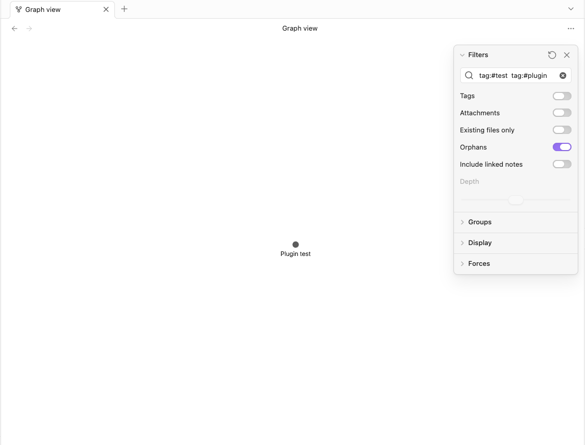
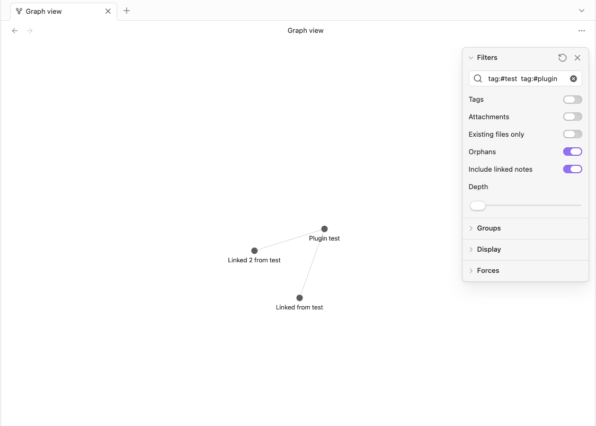
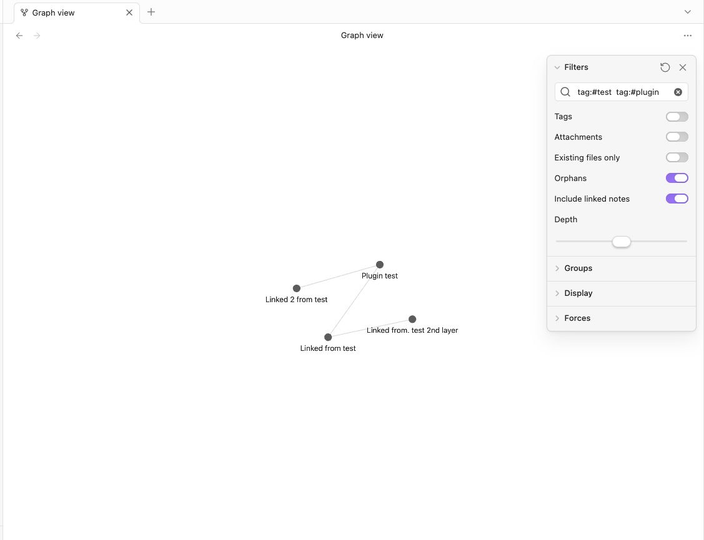

# Graph Search: Linked Notes

**Filtered graph views can now show linked notes**

Obsidian’s **local graph** has a **Depth** slider—you can follow links outward from a note. The **global graph** doesn’t work that way: when you search or filter, you only see files that match, not the notes they link to.

This plugin adds that for the global graph. Filter as you already do, then turn on **Include linked notes** and set **Depth** (1–3) to pull in linked notes alongside your matches.

**Example:** show your daily notes on the graph and still see what they link to—even when those linked notes don’t match the same filter.
You can save the view as a Bookmark too.

## How to use it

1. Turn on the plugin in **Settings → Community plugins**.
2. Open the **graph view** 
3. Open graph settings  if the filter panel is hidden.
4. Add a **Search** filter (for example `tag:#todos` or a path to daily notes).
5. At the bottom of **Filters**:
   - **Include linked notes** — show notes linked from your search results (off by default)
   - **Depth** (1–3) — how many link hops outward; only active when the toggle is on

Until step 4, both controls stay disabled.

**Bookmarks** remember **Include linked notes** and **Depth** per bookmark. **Local graph** is unchanged—use Obsidian’s built-in depth there.

## Screenshots

### Disabled



### Enabled



### Depth: 2



## Known issues

If **Existing files only** is turned off, the graph may show links to notes that don’t exist, including one extra depth.

### Troubleshooting: wrong toggle when opening a bookmark

If a bookmark opens with the wrong **Include linked notes** state, you can turn on debug logging:

1. Open the plugin data file: **Settings → Community plugins →** your plugin folder → `data.json`
2. Add `"debugLogging": true`
3. Reload the plugin, reproduce the issue, then open **View → Developer tools → Console**
4. Filter by `graph-search-linked-notes` and share the log lines (especially `setOptions-payload`, `reconcile`, `tryBindLeaf:mount`)

## Development

```bash
npm install
npm run dev
npm test
```

Reload the plugin after building.

Unit tests cover link expansion, `fileFilter` merge/prune, search seeds, options resolution, the render patch, and settings normalization (no Obsidian app required).
